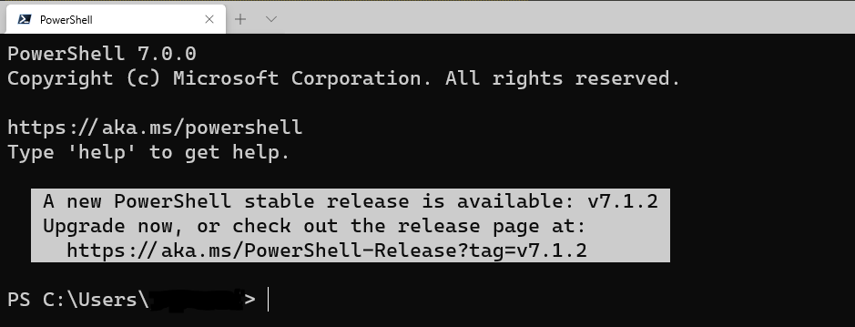
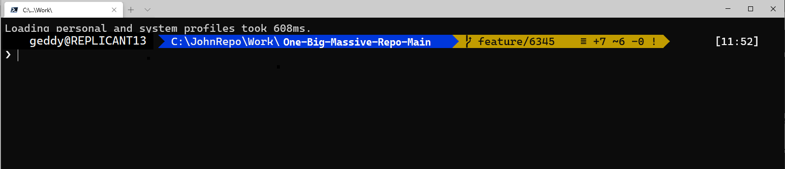
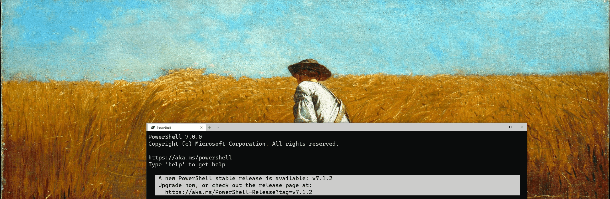
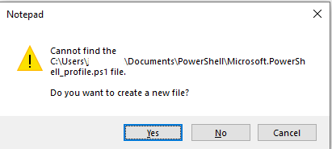

# Setting up Windows Terminal for GIT

### To add a pizaz to your Windows Terminal/ Git experience you can use the modules Posh-Git, Oh-My-Posh in conjunction with a font called **_Cascadia Code PL_** to take your Windows Terminal experience

## **_From This..._**



## **_To This..._**



# Making It Happen

## 1. First step is getting the new fonts from a Git repo onto your personal machine so that your machine can display the appropriate glyphs.

- First, go to the following [Git Repo](https://github.com/microsoft/cascadia-code/releases "Cascadia Code Releases") to download the latest **_CascadiaCode.zip_** file.
- Once downloaded, unzip the file (dont worry too much about the unzip location)
- Navigate to your File Exporer and search for the following **C:\windows\fonts**
- Now that your CascadiaCode file is unzipped, and you have your fonts open in your File Explorer click and drag the 2 files from your unzipped CascadiaCode file (**pictured below**) and drag them into your fonts.
  

## 2. Adjust the Windows Terminal Settings so the Terminal can use the fonts installed above.

- Navigate to the down arrow on the Windows Terminal and click on "**settings**"
- Take the folowing JSON (below) and paste it into the **settings.json** under `"defaults": {` once finished **Save** and close the settings

```JSON
"fontFace": "Cascadia Code PL",
"fontSize": 16
```



## 3. Finally, create a Profile for your Terminal to execute automatically on startup.

- Open your Terminal and type in the following

```POWERSHELL
notepad $Profile
```

- If you do not have a profile yet you will see the following message (below), be sure to click yes and allow the profile to be created
  
- In the Notepad that has been created, paste the below and save the document.

```POWERSHELL
Import-Module posh-git
Import-Module oh-my-posh
Set-Theme Paradox
```

# Shout outs

## Thank you to the following source authors for exposing me and allowing me to create this documentation.
